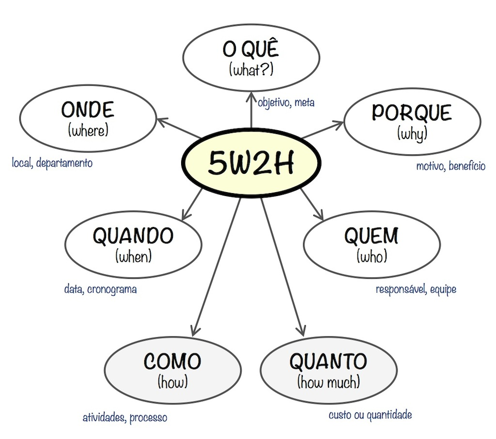

# 
 Artefato 5W2H

Trata-se de um recurso de gestão simples e bastante útil. Alguns definem o 5W2H como uma ferramenta de gestão baseada em checklist. Mas pode-se considerar o 5W2H como um framework conceitual, baseado em sete perguntas chave, sendo essas:

## Referencias

[Treasy - O que é 5W2H](https://www.treasy.com.br/blog/5w2h/)

[Vídeo que a profa passou](https://www.youtube.com/watch?v=RTiugdJLQDA)