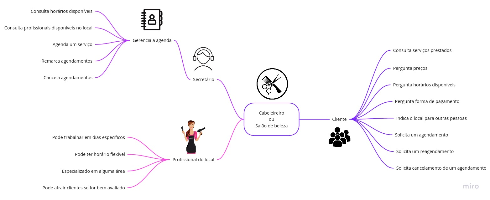
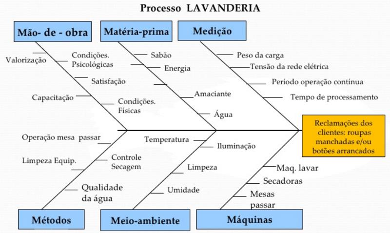

# 
 Projeto Não Orientado a Abordagens Específicas
 

Existem artefatos que podem ser criados sem que o projeto tenha uma metodologia estabelecida, como 5W2H, Mapa Mental, Diagrama Causa-Efeito, Rich Pictures, Glossário, Léxico e Planos de Risco, Custo e Tempo, entre outros, pois ajudam na obtenção de uma noção inicial sobre o escopo do projeto que será desenvolvido.

## 5W2H

Trata-se de um recurso de gestão simples e bastante útil. Alguns definem o 5W2H como uma ferramenta de gestão baseada em checklist. Mas pode-se considerar o 5W2H como um framework conceitual, baseado em sete perguntas chave, sendo essas:

## Mapa Mental

O Mapa Mental é uma ferramenta que permite a organização de seu conteúdo de maneira harmônica com os processos cognitivos, ou seja, a disposição dos elementos é feita da mesma forma como ocorre em nosso cérebro, facilitando a memorização e a compreensão do que está escrito. Ele contribui para a solução de problemas, uma vez que ajuda a visualizar e diagnosticar todos os aspectos e consequências de uma situação, criando um panorama que possibilita o melhor entendimento da mesma.

A técnica para realização consiste em colocar bem no centro do mapa o assunto que será abordado. A partir dali, vão sendo puxados para os lados os assuntos relacionados, podem ser pessoas, coisas, assuntos... depende do que está sendo criado. A ideia é que você possa "bater o olho" e entender a ideia pro trás, por isso é importante manter escritas sucintas o suficiente para não deixar o mapa poluído mas explicativas o suficiente para o entendimento não depender da memória de quem criou o artefato. 

Esse foi o que eu criei para a matéria de DSW.

## Diagrama de Ishikawa

O Diagrama de Ishikawa , também conhecido como "Diagrama de Causa e Efeito" ou "Espinha-de-peixe", é utilizado pela administração para o gerenciamento e controle de qualidade sendo uma ferramenta gráfica que auxilia em diversos processos. Os diagramas de Ishikawa são ferramentas sistemáticas muito úteis para encontrar, classificar e documentar as causas da variação da qualidade em uma determinada produção e organizar a mútua relação entre elas.

A utilização desse diagrama parte da premissa de que todo problema tem uma causa específica. Dessa forma, eliminar a causa-raiz significa, consequentemente, elimina o problema. Para descobri-la, portanto, o método sugere o teste e análise de cada sugestão de causas feitas pela equipe.

O diagrama de Ishikawa se trata de mais uma representação gráfica e ele traz consigo as seguintes vantagens de uso:
- Melhor visibilidade dos problemas a serem enfrentados
- Identificação das possíveis causas de forma ágil e assertiva;
- Hierarquização e priorização das causas encontradas;
- Registro visual intuitivo que facilita futuras análises;
- Aperfeiçoamento dos processos e melhoria contínua;
- Exploração dos desdobramentos do problema na empresa;
- Envolvimento de toda a equipe na gestão da qualidade e na melhoria de processos;
- Organização das ideias do grupo, com foco e objetividade.

Exemplo de diagrama de causa e feito:

## Plano de risco

Esse eu não entendo muito bem mas sei que o objetivo do gerenciamento dos riscos é aumentar a probabilidade e o impacto dos eventos positivos e reduzir a probabilidade e o impacto dos eventos negativos no projeto. Para criar todo o plano de riscos, existem algumas etapas a serem seguidas:

**1. Planejamento:** definir como serão conduzidas as atividades de gerenciamento dos riscos do projeto. O principal benefício deste processo é que ele garante que o grau, tipo, e visibilidade do gerenciamento dos riscos sejam proporcionais tanto aos riscos quanto à importância do projeto para a organização;

**2. Identificação dos riscos**: determinar quais riscos podem afetar o projeto e documentar suas características. O principal benefício desse processo é a documentação dos riscos existentes e o conhecimento e a capacidade que ele fornece à equipe do projeto de antecipar os eventos. Identificar os riscos é um processo iterativo, pois novos riscos podem surgir ou se tornar evidentes durante o ciclo de vida do projeto. A frequência da iteração e participação em cada ciclo variará de acordo com a situação.

**3. Análise qualitativa e quantitativa dos riscos:** A análise **qualitativa** dos riscos é o processo de priorização de riscos para ação posterior através da avaliação e combinação de sua probabilidade de ocorrência e impacto. Já a análise **quantitativa** dos riscos é o processo de analisar numericamente o efeito dos riscos identificados nos objetivos gerais do projeto.

Para fazer essa análise são considerados: probabilidade do risco ocorrer, o grau de impacto dele sobre o projeto e, então, categorizam-se os riscos em:

- Técnico: Trata das habilidades, requisitos, equipamentos e logística que serão avaliados no desenvolvimento do projeto.

- Externo: Trata-se de tudo aquilo fora do ambiente de trabalho que pode influenciar a equipe e o projeto, de maneira positiva ou negativa.

- Organizacional: Ações tomadas pela equipe de desenvolvimento que podem ou não estar de acordo com o planejamento inicial.

- Gerenciamento de projeto: Levantamento de possíveis acontecimentos que possam mudar os prazos ou tarefas designadas previamente.

**4. Planejamento das respostas aos riscos:** Desenvolver opções e ações para aumentar as oportunidades e reduzir as ameaças aos objetivos do projeto. O principal benefício deste processo é a abordagem dos riscos por prioridades, injetando recursos e atividades no cronograma e no plano de gerenciamento do projeto, conforme necessário. A prioridade é obtida a partir do produto entre os níveis de probabilidade e impacto.

**5. Controlar os riscos:** Implementar os planos de respostas aos riscos, acompanhamento dos riscos identificados, monitoramento dos riscos residuais, identificação de novos riscos e avaliação da eficácia do processo de riscos durante todo o projeto. O principal benefício desse processo é a melhoria do grau de eficiência da abordagem dos riscos no decorrer de todo o ciclo de vida do projeto, a fim de otimizar continuamente as respostas aos riscos.

As respostas planejadas aos riscos que estão incluídas no registro dos riscos são executadas durante o ciclo de vida do projeto, mas o trabalho do projeto deve ser continuamente monitorado em busca de riscos novos, modificados e desatualizados.

## 📌 Referencias

[Treasy - O que é 5W2H](https://www.treasy.com.br/blog/5w2h/)

[Vídeo que a profa passou - 5W2H](https://www.youtube.com/watch?v=RTiugdJLQDA)

[Mapa Mental: O que é e Como Fazer.](https://www.sbcoaching.com.br/blog/mapa-mental/)

[Diagrama de Ishikawa: o que é e como fazer](https://www.siteware.com.br/blog/metodologias/diagrama-de-ishikawa/)
