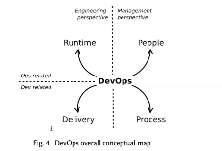
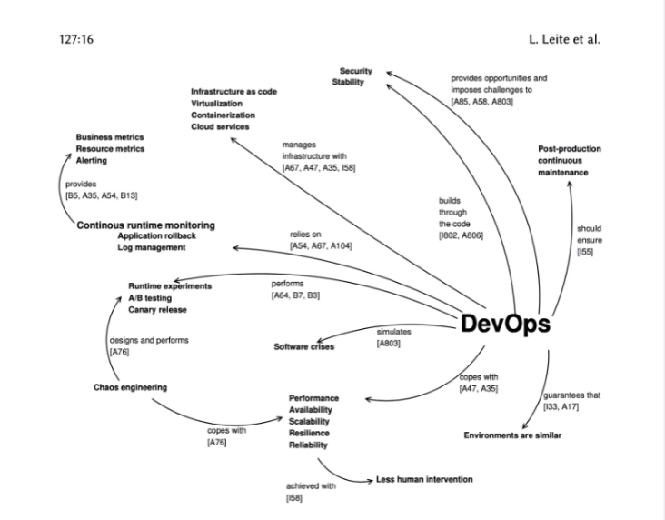

# 
 DevOps

O DevOps é um conjunto de práticas que une a parte de desenvolvimento com a parte de operações (quem escreve os códigos com a galera que opera o TI, ou seja, testa e lança as aplicações). Algumas pessoas acabam atribuindo o gerenciamento dessas tarefas a uma pessoa que tenha essas habilidades, e daí surge o papel de DevOps, mas, na realidade, DevOps é mais do que um papel, é toda uma cultura e um conjunto de práticas.

Toda cultura de colaboração e todas as pessoas que estejam ligadas a entregas contínuas fazem parte do DevOps.

    

## Culturas
Quem define a cultura de DevOps são as pessoas que lideram as empresas, trabalham as questões sobre como elas vão lidar com as falhas que podem ocorrer, gerenciamento de riscos e 

| Patológica | Burocrática| Generativo |
| -- | -- | -- |
| Orientada a poder | Orientada a regras | Orientada a performance |
| Pouca cooperação | Cooperação modesta | Coorperação alta  e incentivada |
| Responsabilidades  compartilhadas | | Riscos compartilhados |

### 3 meios para atingir a cultura de DevOps
🍂 Mapear o fluxo de valor global 
🍂 Ambliar feedbacks e suporte necessário para correções 
🍂 Melhor o dia a dia da empresa com frequente experimentação, aprender com erros e aprender quais práticas são boas e os pré requisitos para melhorar as automações.

## Entrega contínua
É uma entrega onde qualquer versão de commit que possa ser uma versão candidata a produção. O objetivo é ter uma build estável e trabalha aspectos de qualidade para a produção e aspectos de automação dessas entregas.

O importante não é só automzatizar os stages (definidos de acordo com o que a organização considera importante), mas também ter métricas para verificar como se está bom ou não.

## Integração contínua
Integra e teste acontecem em algumas horas, programação do time é dividir, conquistar e integrar o problema; divide ele e depois junta pra resolver. É um sistema não linear então tem uma integração imprevisível, e tem que ser uma coisa rápida porque quanto mais demora, mais caro fica pra conseguir fazer essa integração.

## Práticas de Runtime
Runtime é o sistema funcionando, então todas as práticas e todas as ferramentas pra auxiliar nisso é configurado com práticas de runtime. 

São práticas ágeis quando leva pras tarefas de automação, no que elas se transformam. Tipo monitoração contínua em tempo de execução, etc etc. Isso tudo é pra manter o processo de DevOps para cada cenário, cada área, tudo com menos intervenção humana.

    

 
<figcaption align="center">
    <b>Categorização de conceitos de runtime</b>
     
    <small>Fonte: Leonardo Leite et al.</small>
</figcaption>

## Microsserviços
Microsserviços são um tipo inovador de arquitetura de software, que consiste em construir aplicações desmembrando-as em serviços independentes. Estes serviços se comunicam entre si usando APIs e promovem grande agilidade em times de desenvolvimento.

Diferentemente da abordagem tradicional monolítica em que toda a aplicação é criada como um único bloco, os microsserviços são componentes separados que trabalham juntos para realizar as mesmas tarefas.

Precisa de DevOps porque precisa de um time que tome conta daquele serviço, então precisa de colaboração; precisa de automação de cada pipeline de cada microsserviço, e também precisa estar em um ambiente estável. Est

E o DevOps precisa de microsserviços porque fazer isso com serviços monolíticos é mais difícil. O DevOps viabiliza o microsserviço e vice-versa.

## 📌 Referências

**O que são microsserviços e como funcionam?** Disponível em [https://blog.geekhunter.com.br/arquitetura-de-microsservicos-x-arquitetura-monolitica/#O_que_sao_microsservicos](https://blog.geekhunter.com.br/arquitetura-de-microsservicos-x-arquitetura-monolitica/#O_que_sao_microsservicos)

**Trunk Based Development - TBD** [https://www.linkedin.com/pulse/trunk-based-development-tbd-evandro-couto/](https://www.linkedin.com/pulse/trunk-based-development-tbd-evandro-couto/)