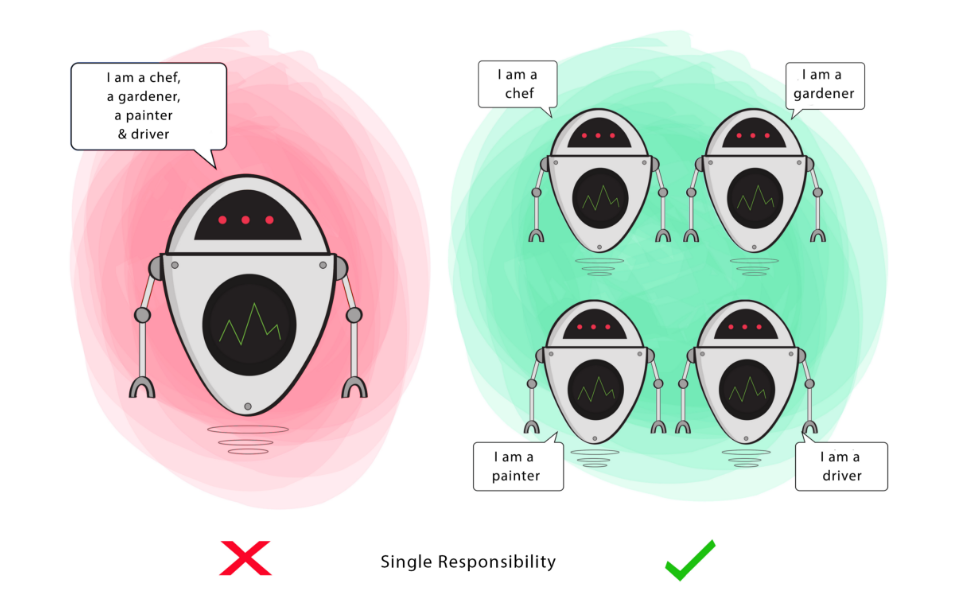
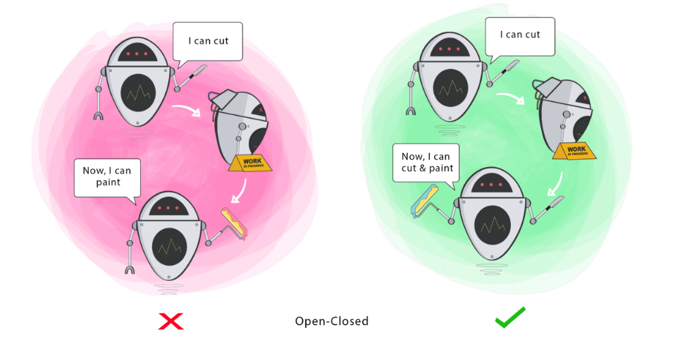
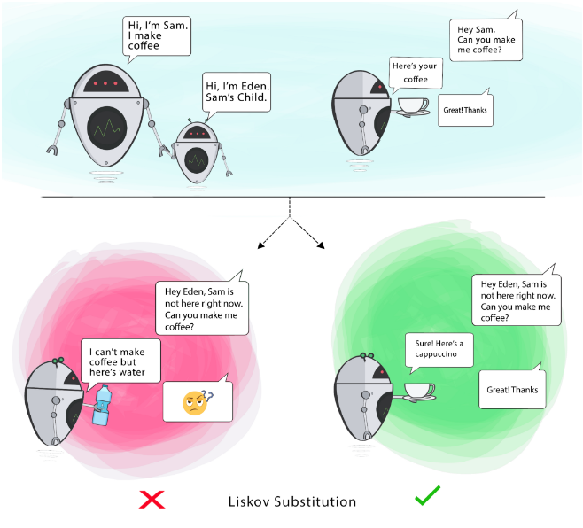
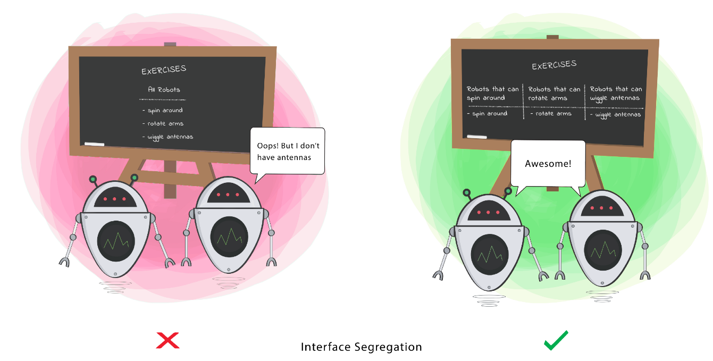
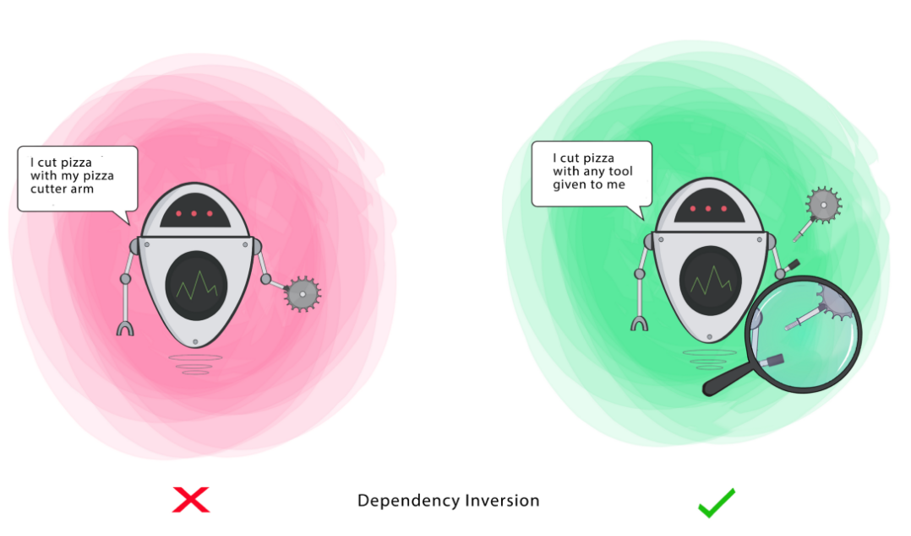

# 
 Princípios S.O.L.I.D

Os princípos SOLID são cinco princípios da programação orientada a objetos que facilitam no desenvolvimento de softwares; servem pra gente codar melhor. Quando seguidos direitinho, ajudam a diminuir o acoplamento, facilitar a manutenção, facilitar a automação de testes e etc. Solid, na verdade, é um acróstico e cada letra dele significa um princípio.

**S** : _Single Responsability Principle_ __(SRP)__ -> Princípio da Responsabilidade Única; 
**O** : _Open-Closed Principle_ __(OCP)__ -> Princípio Aberto-Fechado; 
**L** : _Liskov Substitution Principle_ __(LSP)__ -> Princípio da substituição de Liskov; 
**I** : _Interface Segregation Principle_ __(ISP)__ -> Princípio da Segregação da Interface; 
**D** : _Dependency Inversion Principle_ __(DIP)__ -> Princípio da inversão da dependência.

Os exemplos em código pra cada um dos princípios estão no link das referências, e a explicação em vídeo também, muito boa e muito prática!!

### Single Responsability Principle (SRP)
Esse é o princípio que tem a ver com MUDANÇAS, dizendo que uma classe deve ter um único motivo pelo qual mudar. Se você precisar mudar uma coisa X, a classe também precisará mudar; se você mudar uma coisa Y e ela também precisar mudar, isso indica que ela, provavelmente, tem responsabilidades demais. 

Responsabilidade não significa funcionalidade, mas pode-se sizer que é um objetivo. Esse princípio não se limita somente a classes, ele também pode ser aplicado em métodos e funções, ou seja, tudo que é responsável por executar uma ação, deve ser responsável por apenas aquilo que se propõe a fazer.

    

### Open-Closed Principle (OCP)
O significado desse princípio é que objetos ou entidades devem ser abertos para extensões mas fechados para modificações. Ou seja, você deve ser capaz de "criar mais" daquilo ou modificar o comportamento de uma extensão específica, mas o principal não deve ser alterado quando isso acontecer. É aquele famoso exemplo da classe animal, que fica dependendo do tipo do animal e a cada um que quiser adicionar, precisa modificá-la. Mas se seguir o princípio, ela vira uma classe com métodos virtuais que são só sobrescritos na classe de cada novo animal.

    

### Liskov Substitution Principle (LSP)
Esse princípio meio que complementa o princípio anterior, do open-closed, porque ele vai dizer que uma classe filha deve ser substituível pela classe pai. Ou seja, se A é uma filha de B, então um objeto do tipo A deve conseguir fazer as mesmas coisas que um objeto do tipo B, sem que haja problema ou substituição de métodos.

**Exemplos de violação do LSP:** 
- Sobrescrever/implementar um método que não faz nada;
- Lançar uma exceção inesperada;
- Retornar valores de tipos diferentes da classe base;

    

### Interface Segregation Principle (ISP)
Esse é um princípio meio zuado mas diz mais ou menos o seguinte: uma classe não deve ser forçada a implementar interfaces e métodos que não irão utilizar. Esse princípio basicamente diz que é melhor criar interfaces mais específicas ao invés de termos uma única interface genérica.

    Clients should not be forced to depend on methods that they do not use.

    

### Dependency Inversion Principle (DIP)
Esse também é ruim de entender mas diz assim: dependa de abstrações e não de implementações. Módulos de alto nível não devem depender de módulos de baixo nível; ambos devem depender da abstração. E Abstrações não devem depender de detalhes, eles que devem depender de abstrações.

**Definições:**
- Módulo (ou classe) de **alto nível**: classe que executa uma ação com uma ferramenta;
- Módulo (ou classe) de **baixo nível**: a ferramenta necessária para executar a ação;
- **Abstração**: representa uma interface que conecta as duas classes;
- **Detalhes**: como a ferramenta funciona.

    

 

## 📌 Referencias

Felipe Deschamps, [**SOLID fica FÁCIL com Essas Ilustrações**](https://www.youtube.com/watch?v=6SfrO3D4dHM) -> Vídeo muuito legal explicando cada conceito. Usa as ilustrações que usei aqui.

Dmitry Sichkar, [**Aplicação de SOLID em Python**](https://gist.github.com/dmmeteo/f630fa04c7a79d3c132b9e9e5d037bfd#file-2-ocp-py-L31) -> Aqui tem exemplos de código para cada princípio.

Backticks & tildes, [**The S.O.L.I.D Principles in Pictures**](https://medium.com/backticks-tildes/the-s-o-l-i-d-principles-in-pictures-b34ce2f1e898) -> De onde tirei as ilustrações.