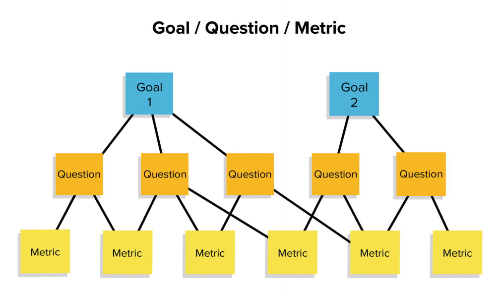

# 
 Medição de processos

Como comentado no finalzinho da visão geral, a medição é o primeiro passo pra realizar a melhoria. Medir é pegar dados quantitativos do processo, como tempo necessário pra fazer alguma coisa. Essas medições podem ser usadas pra avaliar a melhoria da eficiência de um processo, como o tempo necessário pra fazer alguma coisa, mas a medida por si só não determina se a qualidade do produto melhorou ou não. Existem métricas que podem ser coletadas:

| Métricas | 
Descrição
|--|---|
| Tempo necessário | O tempo necessário para um processo específico ser concluído. Esse pode ser o tempo total dedicado para o procesÿso, o tempo de calendário, o tempo dispendido no processo por engenheiros particulares, e assim por diante. |
| Recursos necessários | Os recursos necessários para um determinado processo. Os recursos podem incluir total empenho em pessoas/ dia, custos de viagens ou recursos de computador.|
| Ocorrência de eventos | O número de ocorrências de um determinado evento. Exemplos de eventos que podem ser monitorados incluem o número de defeitos descobertos durante a inspeção de código, o número de mudanças de requisitos soliciÿtados e o número médio de linhas de código modificadas em resposta a uma mudança de requisitos.|

Medir **tempo** e **recurso** necessários pra fazer alguma coisa são as informações capazes de descobrir se uma mudança melhorou a eficiência do processo. Já a medição sobre o **ocorrência** de eventos tem mais relação direta com a qualidade do trem, porque o aumento de número de defeitos em um software provavelmente reflete na qualidade dele.

Uma dificuldade fundamental no processo de medição é saber quais informações sobre o processo devem ser coletadas para apoiar a melhoria de processo. Pra isso, existe o paradigma de metas-questões-métricas GQM (Goal-Question-Metric), que serve pra responder as perguntas:

**1.** Por que estamos introduzindo melhorias de processos? 
**2.** De quais informações precisamos para ajudar a identificar e avaliar as melhorias? 
**3.** Quais medições de processo e produto são necessárias para fornecer essas informações? 

O bichão é esse aqui:

Mas o que significa cada coisa? Pois então, as **metas** são realmente o que o nome diz, as metas heheh é aquilo que a organização, a empresa, pretende atingir. Não tem nada a ver com os atributos do processo (as características que podem ser medidas nele), mas se relaciona com os efeitos do processo; como ele afeta a organização e os produtos gerados por ele. **Ex.:** a meta da empresa pode ser "diminuir o tempo de desenvolvimento".

As **questões** são refinamentos das metas. Aqui você vai criar perguntas cujas respostas te façam explorar a meta, explorar o que pode ser feito pra atingir essa meta. **Continuação do ex.:** Onde estão os gargalos de nosso processo atual?; Como podemos reduzir o tempo necessário para finalizar os requisitos?; Quantos dos testes são eficientes pra descobrir defeitos de produtos?.

Mais detalhado ainda, surgem as **métricas**. Como a gente já vem lendo sobre isso, uma métrica é algo que pode ser medido, então uma métrica que detalha uma questão é a medida pra alguma das perguntas levantadas. **Ex.:** coletar dados sobre o tempo levado para concluir cada atividade do processo.

