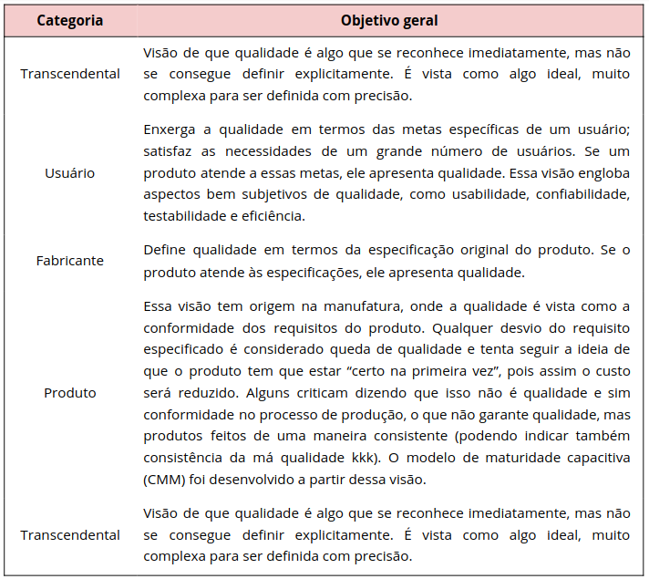
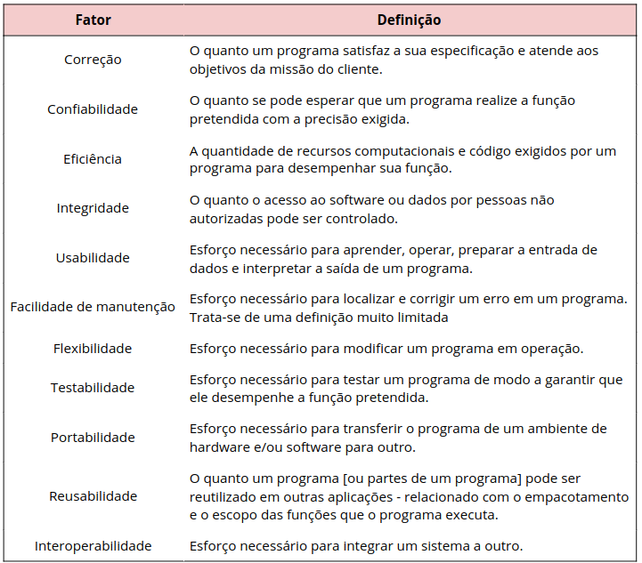
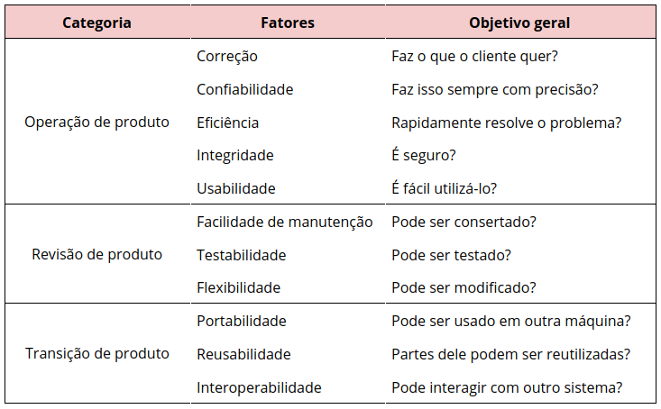

# 
 Qualidade de Software

A qualidade de um software pode ser entendida como um conjunto de características a serem satisfeitas, de modo que o produto de software atenda às necessidades de seus usuários e atenda as expectativsa do cliente. 

### Visões de qualidade

Existem vários aspectos que impactam na qualidade de um software e ela pode ser enxergada por 5 diferentes visões, de diferentes áreas:

### Fatores de qualidade de McCall
McCall e amigos criaram uma proposta de categorização dos fatores que afetam a qualidade de software. Esses fatores de qualidade de software se concentram em três importantes aspectos de um produto de software: as características operacionais, a capaci­dade de suportar mudanças e a adaptabilidade a novos ambientes. São 11 fatores relacionados à qualidade, segundo esse autor aí:

### Categorias de McCall

Os 11 fatores da tabela acima se relacionam com 3 grandes áreas: **Operação de produto**, **Revisão de produto** e **Transição de produto**. Existe mais uma tabelinha que facilita a visualização de cada fator e sua respectiva grande área. Fiz uma tabela totalmente fora do padrão aqui mas é porque precisava mesclar células. E eu prefiro rosa.

## Referências

[DevMedia](https://www.devmedia.com.br/qualidade-de-software-engenharia-de-software-29/18209)

[WikiLivrs](https://pt.wikibooks.org/wiki/Engenharia_de_Software/Qualidade_de_Software#:~:text=A%20vis%C3%A3o%20transcendental%20sustenta%20(assim,metas%20espec%C3%ADficas%20de%20um%20usu%C3%A1rio.&text=Se%20o%20produto%20atende%20%C3%A0s%20especifica%C3%A7%C3%B5es%2C%20ele%20apresenta%20qualidade.)

